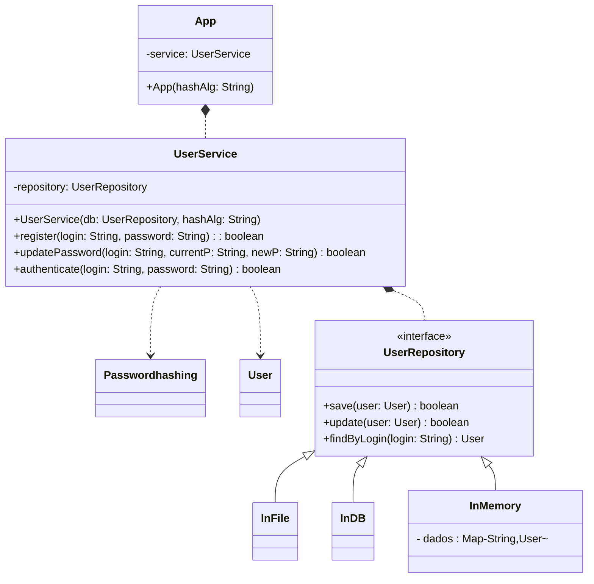

```mermaid
classDiagram 
    direction TB

    class Passwordhashing
    class App {
        -service: UserService
        +App(hashAlg: String)
        
    }
    class User
    class UserService{
        -repository: UserRepository 
        +UserService(db: UserRepository, hashAlg: String)
        +register(login: String, password: String): boolean
        +updatePassword(login: String, currentP: String, newP: String) boolean
        +authenticate (login: String, password: String) boolean
        
    }
    
    class UserRepository{
        <<interface>>
        +save(user: User) boolean 
        +update(user: User) boolean
        +findByLogin(login: String) User
    }
    
    class InMemory {
        - dados : Map-String,User~
        
    }
    
    
    UserRepository <|-- InFile
    UserRepository <|-- InDB
    UserRepository <|-- InMemory
    
    App *.. UserService
    UserService *.. UserRepository 
    UserService ..> User
    UserService ..> Passwordhashing


```